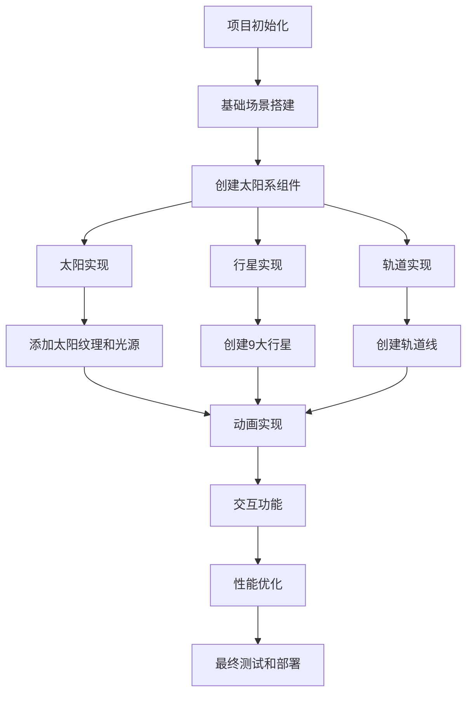

# 太阳系行星动画实现计划

## 项目概述
创建一个3D太阳系动画，展示9大行星绕太阳运转的场景。

## 运行效果


## 需求分析
- 3D动画效果
- 不需要严格按照实际比例
- 包含行星名称和轨道线
- 视觉风格不限

## 技术栈
- Three.js - 3D渲染库
- HTML5/CSS3 - 基础结构和样式
- JavaScript ES6+ - 业务逻辑实现

## 实施流程



## 详细步骤

### 1. 项目初始化
- 创建项目目录结构
- 安装必要的依赖（Three.js）
- 设置基本的HTML/CSS/JavaScript文件

### 2. 基础场景搭建
- 创建3D场景
- 设置摄像机
- 配置渲染器
- 添加基本的灯光系统

### 3. 创建太阳系组件
#### 太阳实现：
- 创建发光的球体
- 添加基本的材质效果
- 设置合适的光源

#### 行星实现：
- 创建9个不同大小的球体
- 为每个行星添加基本材质
- 设置行星名称标签

#### 轨道实现：
- 创建轨道线
- 设置不同轨道半径

### 4. 动画实现
- 实现行星自转
- 实现行星公转
- 添加轨道动画效果

### 5. 交互功能
- 添加摄像机控制
- 实现鼠标交互（放大/缩小/旋转）
- 添加行星信息显示

### 6. 性能优化
- 优化几何体
- 实现LOD（级别细节）
- 优化渲染性能

### 7. 最终测试和部署
- 进行兼容性测试
- 优化加载时间
- 部署到服务器

## 项目结构
```
solar-system/
├── index.html
├── css/
│   └── style.css
├── js/
│   ├── main.js
│   ├── Scene.js
│   ├── Planet.js
│   ├── Sun.js
│   └── Controls.js
└── assets/
    └── textures/
```

## 时间估算
- 项目初始化和场景搭建：1天
- 太阳系组件实现：2天
- 动画和交互功能：2天
- 性能优化和测试：1天
- 总计：约6天工作时间

## 风险评估
1. Three.js学习曲线可能影响开发速度
2. 3D性能优化可能需要多次调整
3. 浏览器兼容性问题需要特别关注

## 后续优化建议
1. 添加更多的视觉效果（如星云、彗星等）
2. 实现VR模式
3. 添加更详细的行星信息界面
4. 优化移动端体验